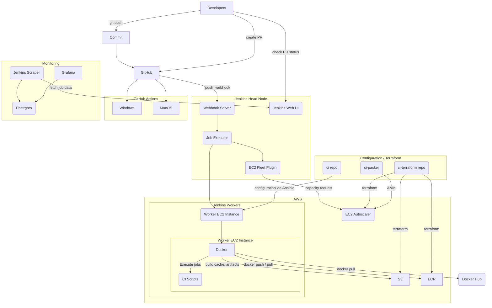

# TVM Upstream CI

This repository holds the configuration as code for the CI of the upstream TVM project hosted on [GitHub](https://github.com/apache/tvm). Specifically, this repository currently handles configuration of a public Jenkins instance, as well as a dedicated set of worker nodes--this Jenkins instance is located at [https://ci.tlcpack.ai](https://ci.tlcpack.ai)

For issues and bug reports, please send them to https://github.com/apache/tvm/issues instead of this repo.

## CI Diagram

This details the individual parts that interact in TVM's CI. For details on operations, see https://github.com/tlc-pack/ci.



## Repository Layout

* [`jenkins`](./jenkins) - configuration for the Jenkins head node
* [`terraform`](./terraform) - Terraform code to provision CI resources in AWS
* [`packer`](./packer) - Packer configurations for AWS AMIs


## Deploying Jenkins

Restarting Jenkins is an occasional but necessary service interruption. To minimize developer impact when updating TVM's Jenkins, follow these steps:

0. Notify users:
    1.  message the TVM Discord with a couple hours notice
    ```
    PSA that we'll be restarting Jenkins soon to <insert reason> -- we will need to retrigger in-flight builds as part of this process, so expect CI slowdowns for the next few hours.
    ```
   2. In Jenkins under Manage Jenkins > Configure System > System Message set it to something like

   ```
   <p style="text-align: center; padding: 10px; background-color: #dc5f5f; font-weight: bold; color: white; border-radius: 8px;">Jenkins will restart on 3/22/22 at 10 AM PDT (<a style="color: #c4e9ff" href="https://discuss.tvm.apache.org/t/ci-jenkins-restart-tuesday-3-21-22/12366/2">details</a>)</p>
   ````
1. Save a list of in-flight jobs (i.e. by saving the webpage at ci.tlcpack.ai to disk)
2. Ensure the latest Terraform defintions have been applied via the [`terraform_apply.yml`](/.github/workflows/terraform_apply.yml) workflow
    1. Pull the Terraform output to the head node by running [`prepare.yml`](https://github.com/tlc-pack/ci/actions/workflows/prepare.yml)
    2. Trigger a `workflow_dispatch` event [`deploy.yml`](https://github.com/tlc-pack/ci/actions/workflows/deploy.yml)
3. Wait for Jenkins to come up (5-ish minutes)
4. Cancel any jobs that Jenkins re-queued (due to [this issue](https://issues.jenkins.io/browse/JENKINS-51936) Jenkins may re-schedule old jobs). Restart any jobs that sent webhooks while Jenkins was down. These JavaScript snippets can help:
    ```javascript
    // cancel all jobs from the main Jenkins page at ci.tlcpack.ai
    const cancel = (x) => {
        let href = x.parentNode.href;
        console.log(href)
        new Ajax.Request(href);
    }
    document.querySelectorAll("img[alt=\"cancel this build\"]").forEach(cancel)
    document.querySelectorAll("img[alt=\"terminate this build\"]").forEach(cancel)
    ```

    ```javascript
    // list unique in-flight and queued job URLs from the saved webpage HTML
    let builds = Array.from(document.getElementById("executors").querySelectorAll("table[tooltip]")).map(x => x.previousSibling.href)
    let builds = [];
    document.getElementById("buildQueue").querySelectorAll("a[tooltip]").forEach(a => {
        builds.push(a.href)
    })
    builds = [...new Set(builds)];
    for (const b of builds) {
        console.log(b);
    }
    ```
5. Check the in-flight PRs from the saved list of jobs and restart the builds for those that didn't automatically restart. Some PRs may have also been submitted while Jenkins was down in which case there will be no Jenkins status reported to the PR. These PRs will need to be re-pushed by the author.
6. Monitor CI for the next day to ensure that autoscaled nodes are being allocated / deallocated as necessary

## Working on Jenkins

Jenkins is configured to not trust Jenkinsfiles from forks by default, so changes to Jenkinsfiles need to be done from branches in the same repository, not from forks. Certain forks are trusted by a plugin in Jenkins but it is reset every time the Jenkins Job Builder re-runs (i.e. every deploy), so it will probably need to be set again for each job. This can be done via this [helper script](/jenkins/scripts/set_trust_on_jobs.py):

```bash
python3 -m pip install jenkinsapi==0.3.13
python3 jenkins/scripts/set_trust_on_jobs.py
```

## Monitoring

Dashboards of CI data can be found:
* within Jenkins at https://ci.tlcpack.ai/monitoring (HTTP / JVM stats)
* at https://monitoring.tlcpack.ai (job status, worker status)

## Troubleshooting Jenkins

- If the `Build Queue` section on https://ci.tlcpack.ai/ is filled with jobs, hover over them to see their time in queue. If it is longer than a few minutes, it is likely that the CI autoscalers are at capacity. Verify this by comparing the fleet size under `EC2 Fleet Status` at the bottom and the limits set in https://ci.tlcpack.ai/configureClouds/.

- If Jenkins is slow or unresponsive, SSH into the head node and restart Jenkins manually via:

    ```bash
    sudo systemctl restart jenkins
    ```
- If Jenkins nodes are running out of disk, SSH into the node and check what is taking up disk space. The limits in Terraform may need to be changed but should be kept as low as possible.
